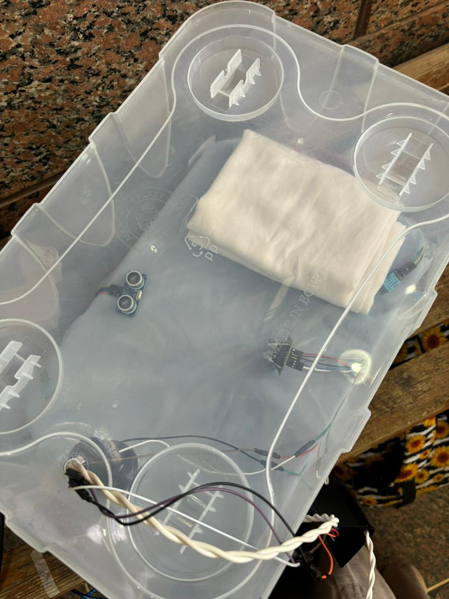

# Infant Incubator Using Arduino

## Overview

This project is an Infant Incubator designed to maintain a stable environment for newborns. It includes features such as temperature and humidity monitoring, door open detection, and jaundice detection. The incubator uses an Arduino to control various sensors and actuators, ensuring the infant's safety and comfort.

## Features

- **Temperature and Humidity Monitoring**: Two DHT11 sensors measure temperature and humidity at different points, providing an average reading for accurate control.
- **Door Open Detection**: An ultrasonic sensor detects if the incubator door is open and triggers an alarm.
- **Heating System**: A relay-controlled 100-watt incandescent bulb acts as a heater to maintain the desired temperature. **Note**: Due to budget constraints, we utilized a 100-watt incandescent bulb as a heating element. In a real-world application, this should be replaced with a proper medical-grade heater to ensure optimal performance and safety.
- **Jaundice Detection**: A color sensor (TCS3200) detects jaundice by measuring the baby's skin color.
- **Alarms**: Two buzzers provide audible alerts for different conditions (door open and low temperature).

## Components

1. [DHT11 Temperature Humidity Sensor Module](https://store.fut-electronics.com/collections/temperature-humidity/products/temperature-amp-humidity-sensor-module)
2. [5V Buzzers](https://store.fut-electronics.com/products/buzzer-5v)
3. [TCS3200 Color Sensor]([https://projecthub.arduino.cc/SurtrTech/color-detection-using-tcs3200230-a1e463](https://free-electronic.com/product/color-sensor-module-tcs3200-tcs230/))
4. [5V Relay](https://www.ram-e-shop.com/ar/shop/kit-sla-30a-1relay-1-output-relay-30a-module-works-on-5v-signal-sku-sla30-7643)
5. 100 Watt Incandescent Light Bulb
6. [HC-SR04 Ultrasonic Sensor Module](https://store.fut-electronics.com/products/ultrasonic-sensor-module)
7. [Arduino Uno](https://store.fut-electronics.com/products/arduino-uno)
8. [Breadboard](https://store.fut-electronics.com/collections/boards/products/breadboard-840-pin)
9. [Male to Female Jumper Wires](https://store.fut-electronics.com/products/male-female-jumper-wire-400-mm)

## Wiring Diagram

### DHT11 Sensors
- Sensor 1: 
  - VCC to 5V
  - GND to GND
  - DATA to Digital Pin 7
- Sensor 2:
  - VCC to 5V
  - GND to GND
  - DATA to Digital Pin 8

### Buzzers
- Buzzer 1 (Door Alarm):
  - VCC to Digital Pin 11
  - GND to GND
- Buzzer 2 (Temperature Alarm):
  - VCC to Digital Pin 12
  - GND to GND

### TCS3200 Color Sensor
- S0 to Digital Pin 2
- S1 to Digital Pin 3
- S2 to Digital Pin 4
- S3 to Digital Pin 5
- OUT to Digital Pin 6
- VCC to 5V
- GND to GND

### HC-SR04 Ultrasonic Sensor
- VCC to 5V
- GND to GND
- TRIG to Digital Pin 9
- ECHO to Digital Pin 10

### Relay and Incandescent Bulb
- Relay IN to Digital Pin 12
- Relay VCC to 5V
- Relay GND to GND
- Connect the bulb to the relay as per the relay module's instructions.

### Breadboard and Jumper Wires
- Use the breadboard and male-to-female jumper wires to make the connections between the components and the Arduino Uno.

## Installation

1. Connect all components as described in the wiring diagram.
2. Upload the provided Arduino code to your Arduino board.
